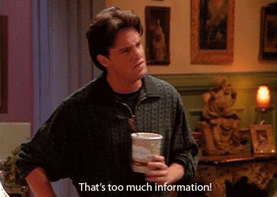
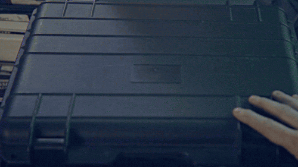

# Web Scraping 101

Introductie in Web Scraping.

## Scraping

> Web-scraping is een techniek waarbij software automatisch gegevens van
> websites verzamelt door de HTML-structuur van de pagina te analyseren en
> specifieke informatie te extraheren. Het wordt vaak gebruikt voor taken zoals
> het ophalen van nieuwsartikelen, het verzamelen van productprijzen of het
> analyseren van concurrenten op het web. 

--- 

## Verschillende opties

Van simpel tot complex.

* One-off - Parse één url.
* Spider - Kruip door een hele site of groep sites.
* Mirror - Als spider, maar bewaar de HTML en assets lokaal.
* Schrijf een gespecialiseerde scraper.

## cURL

## cURL

* Kan alleen maar dingen ophalen
* Kan heel veel HTTP dingen: van headers tot obscure features
* Snapt HTML niet
* Overal beschikbaar
* Kent bijna alle protocollen, niet alleen HTTP(s)

## wget

## wget

* Kent enkel WWW en HTTP(s)
* Heeft HTTP(s) features zoals redirects volgen
* Snapt HTML een beetje
* Heeft opties om links te volgen
* Kan een site mirroren

## Onderdelen

* Iets wat de boel ophaalt
* Iets wat de boel parsed
* Iets wat daaruit informatie haalt

## Ophalen

Alles wat HTTP kent of kan.

* Mirroren: voordeel: eenmalig. nadeel: diskruimte.

## Parsen

* XPATH
* CSS selectors

* Goede HTML (bijna nooit)
* HTML parsers nodig

* Selector vinden en debuggen met developer tools.
* Addons of volledige IDEs om dit te vereenvoudigen.

## Xpath en CSS selectors

* Xpath is erg compleet. Kan bijna alles
* CSS selectors zijn eenvoudiger maar ingwikkelder dingen zijn meteen heel moeilijk.

* Balanceeract tussen fragiel en robuust

## xselectors

